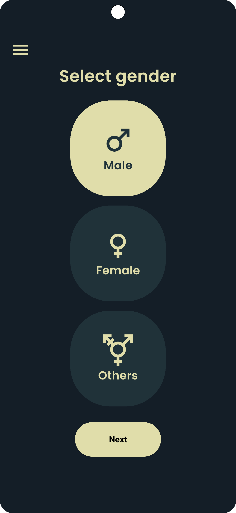
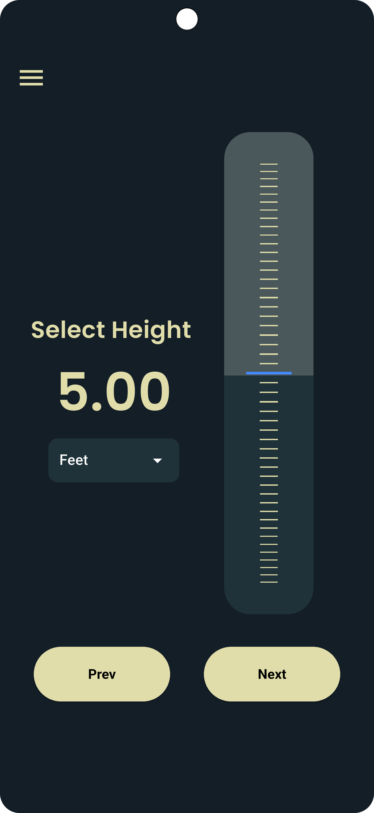
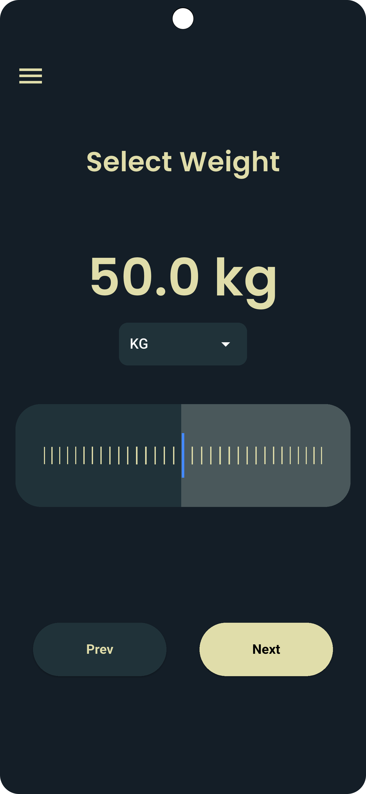
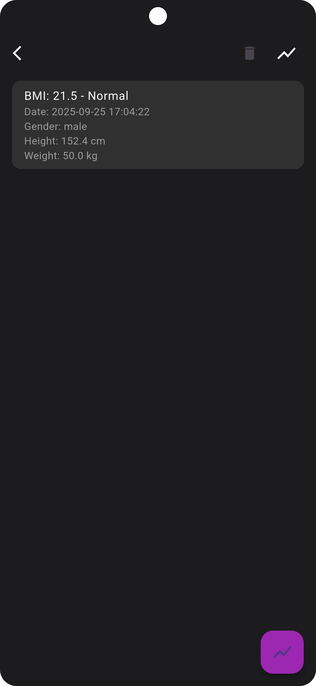
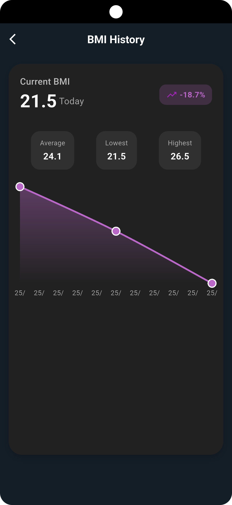
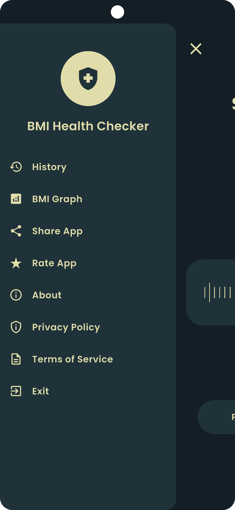
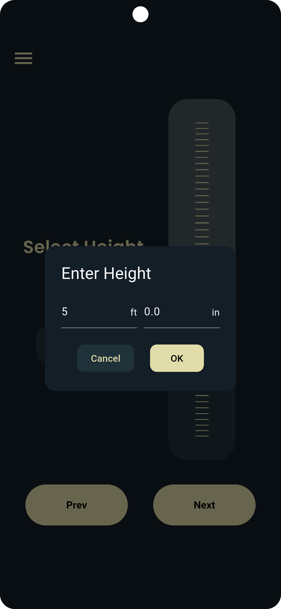

# BMI Health Checker 📊

A modern, comprehensive Flutter application for calculating and tracking Body Mass Index (BMI). Monitor your health journey with beautiful charts, historical data, and personalized insights.

## 🌟 Features

### Core Functionality

- **BMI Calculator**: Accurate BMI calculation using height and weight
- **Multi-Unit Support**: Switch between metric (cm/kg) and imperial (ft/lbs) units
- **Gender Selection**: Tailored calculations and recommendations
- **BMI Categories**: Clear classification (Underweight, Normal, Overweight, Obese)
- **Healthy Weight Range**: Shows ideal weight range for your height

### Advanced Features

- **📈 BMI History & Graphs**: Track your BMI over time with interactive charts
- **💾 Local Data Storage**: Your data stays private on your device
- **📱 Responsive Design**: Optimized for all screen sizes
- **🎨 Modern UI**: Beautiful, intuitive interface with custom animations
- **🔄 Share Results**: Share your BMI results with others
- **📊 Interactive Wheel Sliders**: Smooth, precise input controls

### User Experience

- **Drawer Navigation**: Easy access to history, graphs, and settings
- **Motivational Messages**: Personalized interpretations based on results
- **Ad Integration**: Monetized with Google AdMob
- **Cross-Platform**: Available on Android, iOS, Web, Windows, macOS, and Linux

## 📱 Screenshots

<div align="center">
  
  
  
  
</div>

<div align="center">
  
  
  
</div>

## 🚀 Getting Started

### Prerequisites

- Flutter SDK (>=3.3.4 <4.0.0)
- Dart SDK
- Android Studio / VS Code
- Git

### Installation

1. **Clone the repository**

   ```bash
   git clone https://github.com/alamin-alshaharia/bmi-health-checker.git
   cd bmi-health-checker
   ```

2. **Install dependencies**

   ```bash
   flutter pub get
   ```

3. **Run the app**

   ```bash
   flutter run
   ```


## 🏗️ Project Structure

```
lib/
├── main.dart                 # App entry point
├── calculator.dart           # BMI calculation logic
├── ads/                      # Advertisement management
├── constant/                 # App constants and themes
├── fonts/                    # Custom fonts
├── models/                   # Data models
├── providers/                # State management (Riverpod)
├── screen/                   # UI screens
├── utils/                    # Utility functions
└── widget/                   # Reusable widgets
```

## 🛠️ Technologies Used

### Flutter & Dart

- **Flutter SDK**: Cross-platform UI framework
- **Dart**: Programming language

### State Management

- **Riverpod**: Modern state management solution
- **flutter_riverpod**: Reactive caching and data-binding

### UI/UX

- **wheel_slider**: Interactive wheel input controls
- **fl_chart**: Beautiful, customizable charts
- **flutter_screenutil**: Responsive screen adaptation
- **font_awesome_flutter**: Icon library

### Data & Storage

- **shared_preferences**: Local data persistence
- **package_info_plus**: App version information

### Platform Integration

- **share_plus**: Share functionality across platforms
- **url_launcher**: Launch URLs and external apps
- **connectivity_plus**: Network connectivity monitoring

### Monetization

- **google_mobile_ads**: AdMob integration

### Navigation & UI

- **flutter_slider_drawer**: Custom drawer implementation
- **get**: Route management and utilities
- **flutter_exit_app**: Proper app exit handling

## 📊 Key Components

### BMI Calculator Engine

```dart
class Calculator {
  final double height;
  final double weight;

  double bmiValue() => weight / pow(height / 100, 2);
  String bmiText() { /* BMI category logic */ }
  String bmiInterpretation() { /* Personalized messages */ }
}
```

### State Management

- **BmiProvider**: Manages BMI calculation state
- **Riverpod**: Handles reactive state updates
- **Local Storage**: Persists user data and history

### UI Features

- **Responsive Design**: Adapts to different screen sizes
- **Custom Animations**: Smooth transitions and interactions
- **Theme System**: Consistent color scheme and typography

## 🧪 Testing

The project includes comprehensive testing:

```bash
# Run unit tests
flutter test

# Run integration tests
flutter test integration_test/

# Run specific test file
flutter test test/unit/calculator_test.dart
```

### Test Coverage

- **Unit Tests**: BMI calculation logic
- **Integration Tests**: End-to-end user flows
- **Widget Tests**: UI component testing

## 🔧 Configuration

### AdMob Setup

1. Add your AdMob App ID in `android/app/src/main/AndroidManifest.xml`
2. Configure ad unit IDs in `lib/ads/ad_constants.dart`
3. Update iOS configuration in `ios/Runner/Info.plist`

### App Signing

- Configure signing certificates for release builds
- Update `android/app/build.gradle` for Android
- Configure signing in Xcode for iOS

## 📝 Version History

- **v1.2.0**: Latest stable release
  - Enhanced UI/UX
  - Improved chart functionality
  - Bug fixes and performance improvements

## 🤝 Contributing

1. Fork the repository
2. Create a feature branch (`git checkout -b feature/AmazingFeature`)
3. Commit your changes (`git commit -m 'Add some AmazingFeature'`)
4. Push to the branch (`git push origin feature/AmazingFeature`)
5. Open a Pull Request

## 📄 License

This project is licensed under the MIT License - see the [LICENSE](LICENSE) file for details.

## 📞 Contact

**Developer**: Alamin Al Shaharia
**Email**: <alaminalshaharia@gmail.com>
**GitHub**: [@alamin-alshaharia](https://github.com/alamin-alshaharia)

## 🙏 Acknowledgments

- Flutter team for the amazing framework
- Contributors to the open-source packages used
- Medical professionals who provided BMI calculation standards
- Users who provided feedback and suggestions

## ⚠️ Disclaimer

This app is for informational purposes only and should not be used as a substitute for professional medical advice. Always consult with healthcare professionals for medical decisions and health-related concerns.

---

<div align="center">
  <p>Made with ❤️ using Flutter</p>
  <p>⭐ Star this repo if you found it helpful!</p>
</div>
